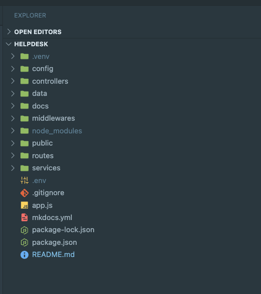
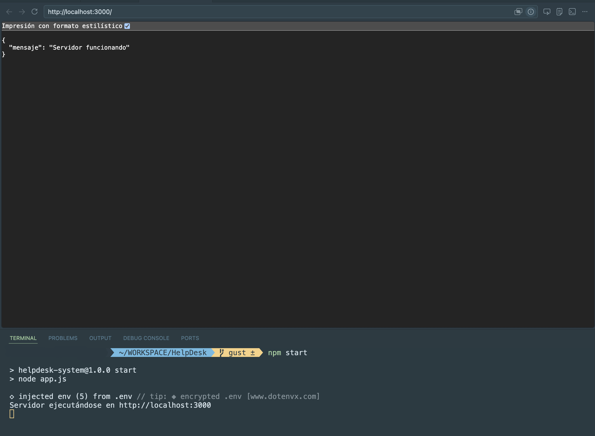
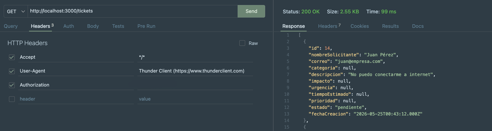
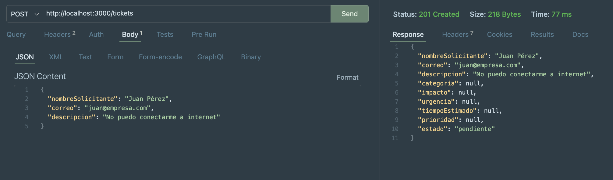
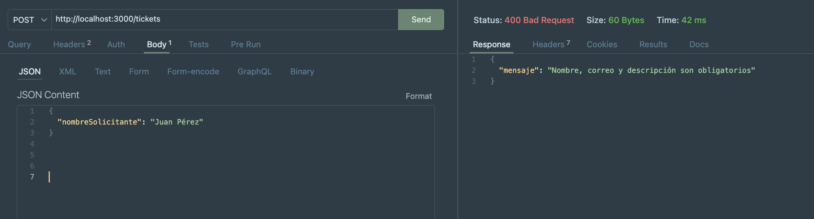
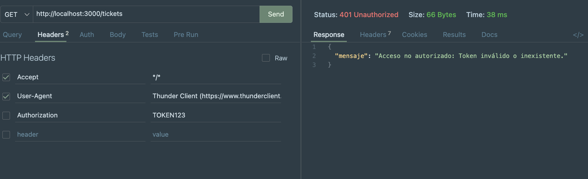
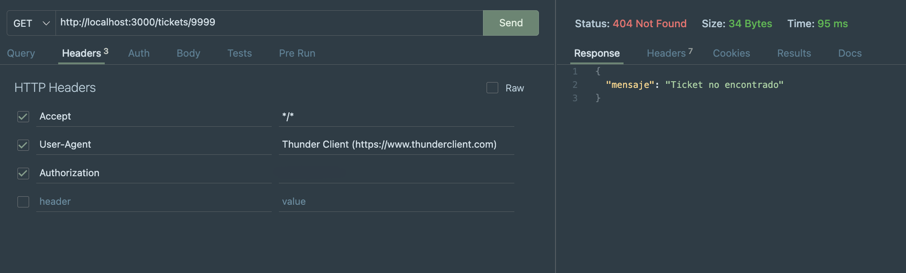
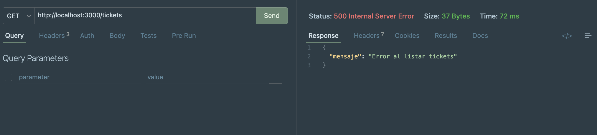
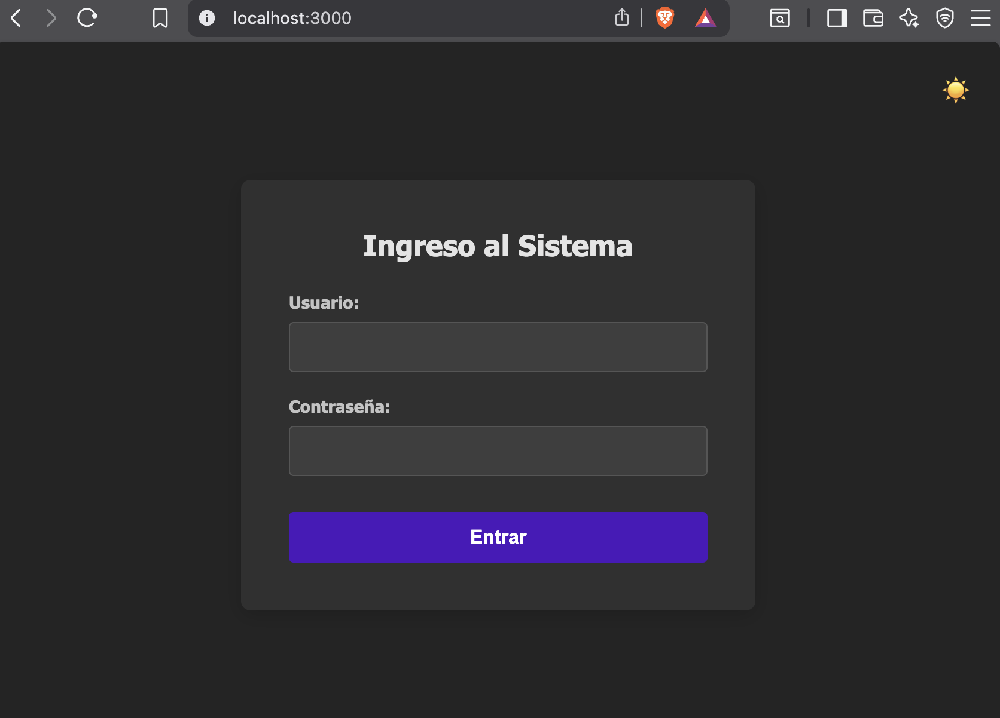
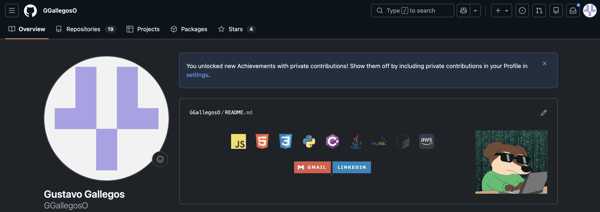

# HelpDesk Smart Priority


Sistema web para gestionar solicitudes de soporte técnico. Permite registrar, clasificar y resolver tickets según un algoritmo automático de priorización basado en impacto, urgencia, categoría y tiempo estimado.

---

## Tecnologías utilizadas

| Capa | Tecnología |
|------|-----------|
| Runtime | Node.js |
| Framework | Express v5 |
| Base de datos | MySQL |
| Driver BD | mysql2 |
| Variables de entorno | dotenv |
| CORS | cors |
| Desarrollo | nodemon |
| Frontend | HTML, CSS, JavaScript (Fetch API) |

---

## Requisitos previos

- Node.js instalado
- MySQL instalado y corriendo
- Git

---

## Instalación

1. Clona el repositorio:
```bash
git clone https://github.com/GGallegosO/HelpDesk.git
cd HelpDesk
```

2. Instala las dependencias:
```bash
npm install
```

3. Crea la base de datos en MySQL:
```sql
CREATE DATABASE helpdesk;
USE helpdesk;

CREATE TABLE tickets (
    id INT AUTO_INCREMENT PRIMARY KEY,
    nombreSolicitante VARCHAR(100) NOT NULL,
    correo VARCHAR(100) NOT NULL,
    categoria VARCHAR(50),
    descripcion TEXT NOT NULL,
    impacto VARCHAR(20),
    urgencia VARCHAR(20),
    tiempoEstimado INT,
    prioridad VARCHAR(20),
    estado VARCHAR(20) DEFAULT 'pendiente',
    fechaCreacion TIMESTAMP DEFAULT CURRENT_TIMESTAMP
);

CREATE TABLE users (
    id INT AUTO_INCREMENT PRIMARY KEY,
    username VARCHAR(50) NOT NULL,
    password VARCHAR(100) NOT NULL,
    rol VARCHAR(20) NOT NULL
);

INSERT INTO users (username, password, rol) VALUES
('admin', '1234', 'admin'),
('usuario1', '1234', 'usuario');
```

4. Configura las variables de entorno. Crea un archivo `.env` en la raíz:
```env
DB_HOST=        # host de tu base de datos (ej: localhost)
DB_USER=        # usuario de MySQL
DB_PASSWORD=    # contraseña de MySQL
DB_NAME=        # nombre de la base de datos (ej: helpdesk)
DB_PORT=        # puerto de MySQL (por defecto 3306)
PORT=           # puerto del servidor (por defecto 3000)
SECRET_TOKEN=   # token secreto para autenticación
```

---

## Ejecución

Modo producción:
```bash
npm start
```

Modo desarrollo (con recarga automática):
```bash
npm run dev
```

El servidor quedará disponible en `http://localhost:3000`

---

## Estructura del proyecto

```
HelpDesk/
├── app.js
├── config/
├── controllers/
├── data/
├── middlewares/
├── routes/
├── services/
├── public/
│   ├── css/
│   ├── js/
│   └── *.html
└── docs/
```

---

## Endpoints

### Autenticación

| Método | Endpoint | Descripción | Requiere token |
|--------|----------|-------------|----------------|
| POST | `/auth/login` | Iniciar sesión | No |

### Tickets

| Método | Endpoint | Descripción | Requiere token |
|--------|----------|-------------|----------------|
| GET | `/tickets` | Listar tickets activos | Sí |
| GET | `/tickets/historial` | Listar tickets resueltos | Sí |
| GET | `/tickets/:id` | Obtener ticket por ID | Sí |
| POST | `/tickets` | Crear nuevo ticket | No |
| PUT | `/tickets/:id/evaluar` | Evaluar y clasificar ticket | Sí |
| PUT | `/tickets/:id` | Editar ticket | Sí |
| PATCH | `/tickets/:id/resolver` | Marcar como resuelto | Sí |

> Los tickets no se eliminan físicamente. Al resolverse cambian su estado a `resuelto` y quedan en el historial.

---

## Ejemplos de uso

### Login
```http
POST http://localhost:3000/auth/login
Content-Type: application/json

{
  "username": "admin",
  "password": "1234"
}
```

Respuesta exitosa (200):
```json
{
  "mensaje": "Login exitoso",
  "token": "<tu_token_secreto>",
  "rol": "admin"
}
```

### Crear ticket (usuario)
```http
POST http://localhost:3000/tickets
Content-Type: application/json

{
  "nombreSolicitante": "Juan Pérez",
  "correo": "juan@empresa.com",
  "descripcion": "No puedo conectarme a internet"
}
```
Respuesta exitosa (201):
```json
{
  "id": 1,
  "nombreSolicitante": "Juan Pérez",
  "correo": "juan@empresa.com",
  "descripcion": "No puedo conectarme a internet",
  "estado": "pendiente",
  "prioridad": null
}
```

### Evaluar ticket (admin)
```http
PUT http://localhost:3000/tickets/1/evaluar
Authorization: 
Content-Type: application/json

{
  "categoria": "red",
  "impacto": "alto",
  "urgencia": "alta",
  "tiempoEstimado": 5
}
```
Respuesta exitosa (200):
```json
{
  "id": 1,
  "categoria": "red",
  "impacto": "alto",
  "urgencia": "alta",
  "tiempoEstimado": 5,
  "prioridad": "Crítica",
  "estado": "en proceso"
}
```

### Resolver ticket (admin)
```http
PATCH http://localhost:3000/tickets/1/resolver
Authorization: 
```
Respuesta exitosa (200):
```json
{
  "mensaje": "Ticket marcado como resuelto"
}
```

---

## Algoritmo de priorización

El sistema calcula automáticamente la prioridad de cada ticket:

**Puntaje por impacto:**
- bajo = 1 punto
- medio = 2 puntos
- alto = 3 puntos

**Puntaje por urgencia:**
- baja = 1 punto
- media = 2 puntos
- alta = 3 puntos

**Bonus:**
- Categoría `red` o `cuenta` → +1 punto
- Tiempo estimado > 4 horas → +1 punto

**Resultado:**

| Puntaje | Prioridad |
|---------|-----------|
| 1 a 3 | Baja |
| 4 a 5 | Media |
| 6 | Alta |
| 7 o más | Crítica |

---

## Seguridad

### Autenticación por token
El sistema utiliza un token estático definido en `.env` (`SECRET_TOKEN`). Al iniciar sesión correctamente, el servidor retorna este token que debe enviarse en el header `Authorization` de cada petición protegida.

### ¿Qué es HTTPS?
HTTPS (HyperText Transfer Protocol Secure) es la versión segura del protocolo HTTP. Utiliza cifrado SSL/TLS para proteger la comunicación entre el navegador y el servidor.

### ¿Qué riesgos mitiga?
- **Interceptación de datos (Man-in-the-Middle):** cifra el tráfico para que terceros no puedan leer los datos transmitidos, como contraseñas o tokens.
- **Robo de credenciales:** sin HTTPS, usuario y contraseña viajan en texto plano y pueden ser capturados en redes públicas.
- **Manipulación de respuestas:** garantiza que la respuesta del servidor no fue alterada en tránsito.

### ¿Por qué es importante en aplicaciones web?
En este sistema, el token de autenticación y las credenciales de login se transmiten en cada petición. Sin HTTPS, cualquier persona en la misma red podría capturar ese token y suplantar a un administrador, accediendo a todos los tickets y pudiendo modificarlos. HTTPS protege la integridad y confidencialidad de esa información.

---

## Evidencias

### Estructura del proyecto


### Servidor ejecutándose


### Operación exitosa (200)


### Ticket creado (201)


### Error validación (400)


### Sin token (401)


### Ticket no encontrado (404)


### Error interno del servidor (500)


### Formulario funcionando


### Repositorio GitHub


---

## Autor

**Gustavo Gallegos**  
[github.com/GGallegosO](https://github.com/GGallegosO)